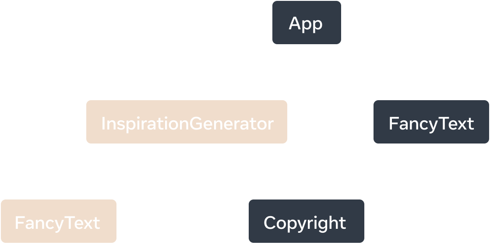

# use client

Dyrektywa `'use client'` deklaruje punkt wejścia dla komponentów, które mają być renderowane po stronie klienta i powinna być używana podczas tworzenia interaktywnych interfejsów użytkownika (UI), które wymagają funkcji JavaScript po stronie klienta, takich jak zarządzanie stanem, obsługa zdarzeń i dostęp do interfejsów API przeglądarki. Jest to funkcja React.

```tsx
'use client'
 
import { useState } from 'react'
 
export default function Counter() {
  const [count, setCount] = useState(0)
 
  return (
    <div>
      <p>Count: {count}</p>
      <button onClick={() => setCount(count + 1)}>Increment</button>
    </div>
  )
}
```

Podczas korzystania z 'use client'dyrektywy właściwości komponentów klienta muszą być serializowalneOznacza to, że rekwizyty muszą być w formacie, który React może serializować podczas przesyłania danych z serwera do klienta.

```tsx
'use client'
 
export default function Counter({
  onClick /* ❌ Function is not serializable */,
}) {
  return (
    <div>
      <button onClick={onClick}>Increment</button>
    </div>
  )
}
```

1. **Komponenty serwera** : służą do tworzenia treści statycznych, pobierania danych i elementów przyjaznych dla SEO.
2. **Komponenty klienta** : Stosuj w przypadku elementów interaktywnych wymagających stanu, efektów lub interfejsów API przeglądarki.
3. **Kompozycja komponentów** : Komponenty klienckie należy umieszczać wewnątrz komponentów serwerowych w razie potrzeby, aby uzyskać wyraźne oddzielenie logiki serwera i klienta.

```tsx
import Header from './header'
import Counter from './counter' // This is a Client Component
 
export default function Page() {
  return (
    <div>
      <Header />
      {/* v------ This is a Client Component */}
      <Counter /> 
    </div>
  )
}
```

**UWAGA:  Cały kod będący częścią poddrzewa modułów klienta jest wysyłany do klienta i przez niego uruchamiany.**

**Jeśli komponent jest zdefiniowany w module za pomocą 'use client' lub jest importowany i wywoływany w komponencie klienckim, wówczas użycie komponentu ma postać komponentu klienckiego.**

```tsx
// inspiration.tsx
'use client';
import { useState } from 'react';
import inspirations from './inspirations';
{/* v----- TO STAJE SIĘ KOMPONENTEM KLIENCKIM - "import" */}
import FancyText from './FancyText';

export default function InspirationGenerator({children}) {
  const [index, setIndex] = useState(0);
  const quote = inspirations[index];
  const next = () => setIndex((index + 1) % inspirations.length);

  return (
    <>
      <p>Your inspirational quote is:</p>
      {/* v----- TO JEST KOMPONENT KLIENCKI - użycie */}
      <FancyText text={quote} />
      <button onClick={next}>Inspire me again</button>
      {/* v----- TO NIE MUSI BYĆ drzewo klienckie */}
      {children}
    </>
  );
}


// app.tsx
export default function App() {
  return (
    <>
    {/* v----- TO NIE MUSI BYĆ KOMPONENTEM KLIENCKIM */}
      <FancyText title text="Get Inspired App" />
      {/* v----- TO JEST KOMPONENT KLIENCKI - 'use client' */}
      <InspirationGenerator>
        {/* v----- TO NIE MUSI BYĆ KOMPONENTEM KLIENCKIM - 'children' */}
        <Copyright year={2004} />
      </InspirationGenerator>
    </>
  );
}
```

